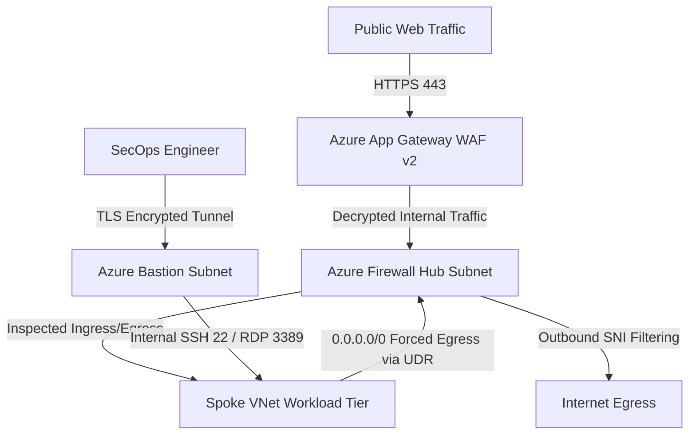

# Azure Enterprise Hub-and-Spoke Secure Network Perimeter

[](https://www.terraform.io/)
[](https://azure.microsoft.com/)
[](#security-controls-implemented)

## Executive Summary
This repository contains a modular, production-ready Infrastructure-as-Code (IaC) Terraform implementation of an **Azure Enterprise Hub-and-Spoke Network Perimeter**. 

The architecture isolates internal workloads in Spoke VNets with **zero public IP exposure**, routes all outbound egress traffic through a centralized **Azure Firewall Premium** instance with SNI filtering, terminates all inbound web traffic at an **Azure Application Gateway WAF v2**, and provides secure administrative access strictly via **Azure Bastion**.

---

## Architecture Diagram



---

## Security Controls Implemented

- [x] **Zero Public IPs on Workloads:** Workload instances in Spoke VNets rely on internal Private IPs only.
- [x] **Centralized Egress Control:** Custom User Defined Routes (UDR) force all `0.0.0.0/0` outbound traffic to Azure Firewall as the Next Hop (`VirtualAppliance`).
- [x] **Inbound Web Application Protection:** Application Gateway WAF v2 configured with OWASP 3.2 ruleset in `Prevention` mode.
- [x] **Secure Bastion Admin Access:** Azure Bastion Standard provides SSH/RDP connectivity without exposing port 22/3389 to the public internet.
- [x] **Microsegmentation:** Network Security Groups (NSGs) bound to all subnets enforce strict default-deny rules for lateral East-West traffic.

---

## Repository Structure

```
azure-hub-spoke-perimeter/
├── README.md
├── scripts/
│   └── validate_perimeter.sh
└── terraform/
    ├── main.tf
    ├── variables.tf
    ├── outputs.tf
    ├── terraform.tfvars.example
    └── modules/
        ├── hub_network/
        │   ├── main.tf
        │   ├── variables.tf
        │   └── outputs.tf
        ├── spoke_network/
        │   ├── main.tf
        │   ├── variables.tf
        │   └── outputs.tf
        ├── firewall/
        │   ├── main.tf
        │   ├── variables.tf
        │   └── outputs.tf
        └── waf/
            ├── main.tf
            ├── variables.tf
            └── outputs.tf
```

---

## Quick Start Deployment

### Prerequisites
- [Azure CLI](https://docs.microsoft.com/en-us/cli/azure/install-azure-cli) `v2.40.0+`
- [Terraform](https://www.terraform.io/downloads) `v1.5.0+`
- Active Azure Subscription with `Owner` or `Contributor` + `User Access Administrator` rights.

### Step 1: Authenticate to Azure
```bash
az login
az account set --subscription "YOUR_SUBSCRIPTION_ID"
```

### Step 2: Configure Environment Variables
```bash
cd terraform
cp terraform.tfvars.example terraform.tfvars
# Edit terraform.tfvars with your target region and prefix
```

### Step 3: Initialize & Deploy via Terraform
```bash
terraform init
terraform validate
terraform plan -out=tfplan.binary
terraform apply tfplan.binary
```

---

## Verification & Automated Testing

Run the automated verification script to validate NSG rules, UDR route tables, and ensure zero public IP assignments:

```bash
bash ../scripts/validate_perimeter.sh -g rg-cloudsec-hubspoke-prod -s YOUR_SUBSCRIPTION_ID
```

---

## Clean-Up
To avoid ongoing charges for Azure Firewall and App Gateway, destroy resources after testing:

```bash
terraform destroy -auto-approve
```
